<p align="center">
  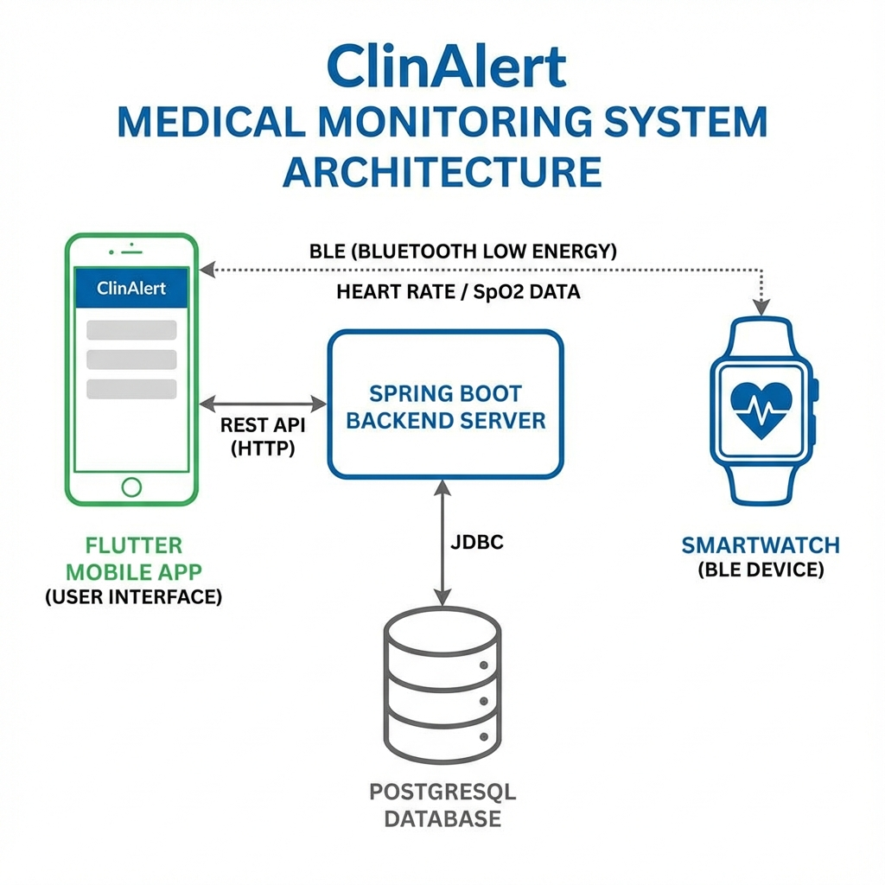
</p>

<h1 align="center">🏥 ClinAlert</h1>

<p align="center">
  <strong>Système Intelligent de Suivi Médical & Monitoring de Santé</strong>
</p>

<p align="center">
  
  
  
  
  
</p>

<p align="center">
  
  
  
</p>

---

## 📋 Table des Matières

- [🎯 À Propos](#-à-propos)
- [✨ Fonctionnalités](#-fonctionnalités)
- [🏗️ Architecture](#️-architecture)
- [📱 Captures d'Écran](#-captures-décran)
- [🚀 Installation](#-installation)
- [⚙️ Configuration](#️-configuration)
- [🔐 Sécurité](#-sécurité)
- [📚 Documentation API](#-documentation-api)
- [🤝 Contribution](#-contribution)

---

## 🎯 À Propos

**ClinAlert** est une plateforme complète de suivi médical intelligent qui permet aux professionnels de santé de surveiller leurs patients à distance grâce à l'intégration de montres connectées (SmartWatch).

### 🎪 Cas d'Utilisation

| Acteur | Fonctionnalités |
|--------|-----------------|
| 👨‍⚕️ **Médecin** | Suivi patients, alertes, rapports PDF, statistiques |
| 👩‍⚕️ **Infirmier** | Saisie mesures manuelles, suivi quotidien |
| 🏥 **Admin** | Gestion utilisateurs, cliniques, configuration |
| 🧑‍🤝‍🧑 **Patient** | Connexion SmartWatch, visualisation données personnelles |

---

## ✨ Fonctionnalités

### 📊 Monitoring de Santé
- ❤️ Fréquence cardiaque (BPM)
- 🫁 Saturation en oxygène (SpO2)
- 🚶 Compteur de pas quotidiens
- 😴 Suivi du sommeil
- 🌡️ Température corporelle
- 💉 Pression artérielle

### 📲 Application Mobile
- 🔗 Connexion Bluetooth BLE avec SmartWatch
- 📈 Graphiques interactifs en temps réel
- 🔔 Alertes automatiques en cas d'anomalie
- 🌍 Support multilingue (Français, English, العربية)
- 🌙 Mode sombre / Mode clair
- 📄 Génération de rapports PDF

### 🖥️ Backend API
- 🔐 Authentification JWT sécurisée
- 👥 Gestion des rôles (Admin, Doctor, Nurse, Patient)
- 📡 API REST avec 50+ endpoints
- 🗄️ Base de données PostgreSQL
- 📊 Calcul automatique des statistiques

---

## 🏗️ Architecture

### Architecture Globale

```
┌─────────────────────────────────────────────────────────────┐
│                    📱 Application Flutter                    │
│              (Android / iOS / Web)                          │
└─────────────────────────────────────────────────────────────┘
                              │
                    HTTPS / REST API
                              │
                              ▼
┌─────────────────────────────────────────────────────────────┐
│                 🖥️ Backend Spring Boot                       │
│            (Controllers, Services, Security)                 │
└─────────────────────────────────────────────────────────────┘
                              │
                           JDBC
                              │
                              ▼
┌─────────────────────────────────────────────────────────────┐
│                   🗄️ PostgreSQL Database                     │
│              (Users, Patients, HealthData, Alerts)          │
└─────────────────────────────────────────────────────────────┘
```

### Stack Technique

| Composant | Technologie | Version |
|-----------|-------------|---------|
| **Frontend** | Flutter | 3.x |
| **Langage Mobile** | Dart | 3.x |
| **State Management** | Provider | Latest |
| **Backend** | Spring Boot | 3.2.0 |
| **Langage Backend** | Java | 17 LTS |
| **Database** | PostgreSQL | 15+ |
| **Authentication** | JWT (jjwt) | 0.11.5 |
| **BLE** | flutter_reactive_ble | Latest |

---

## 📱 Captures d'Écran

### 🔐 Authentification

<p align="center">
  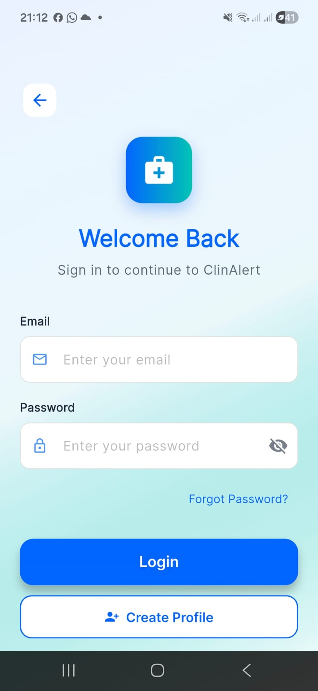
  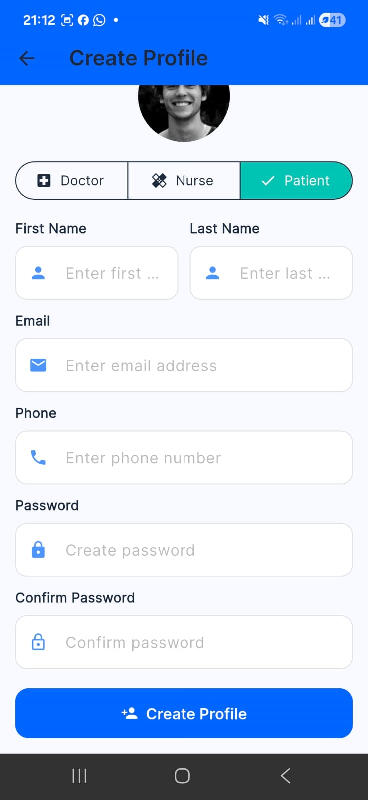
  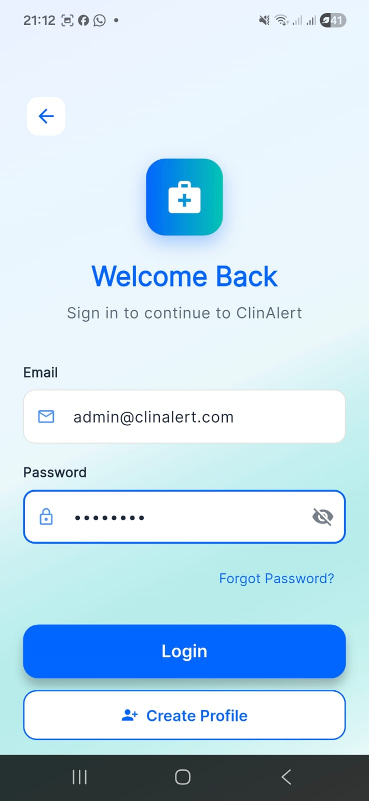
</p>

### 📊 Tableaux de Bord

<p align="center">
  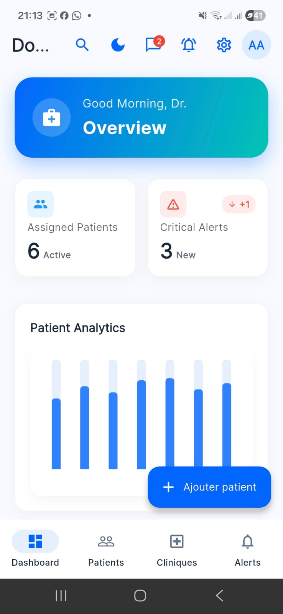
  
  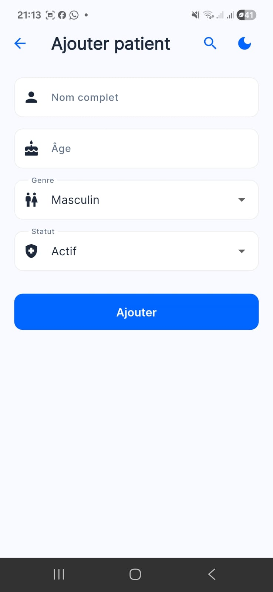
</p>

### 💓 Données de Santé

<p align="center">
  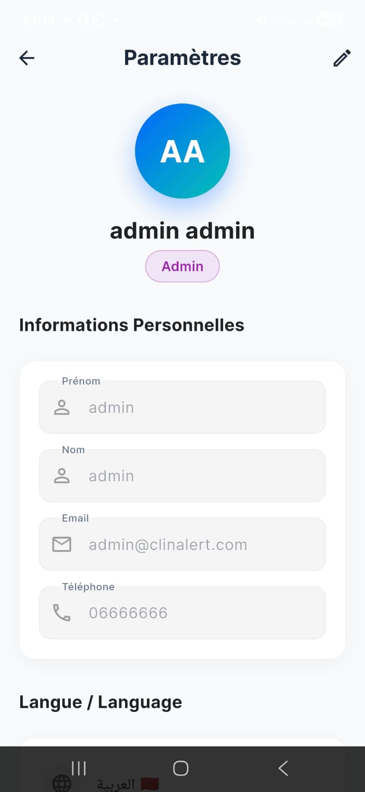
  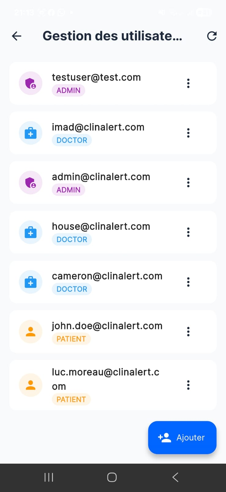
  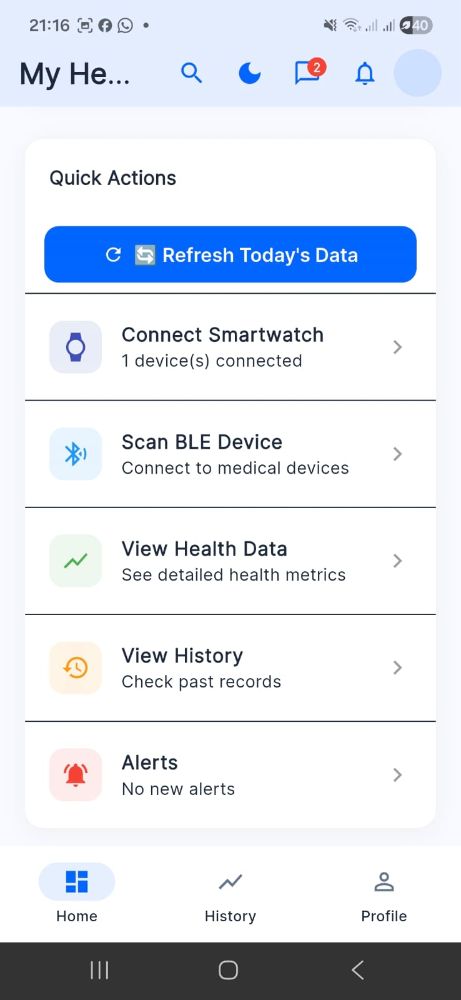
</p>

### ⌚ SmartWatch & Bluetooth

<p align="center">
  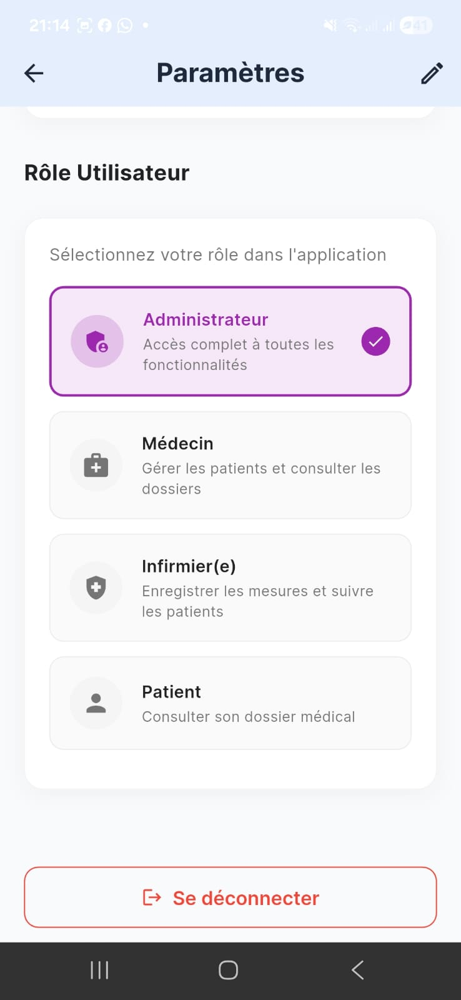
  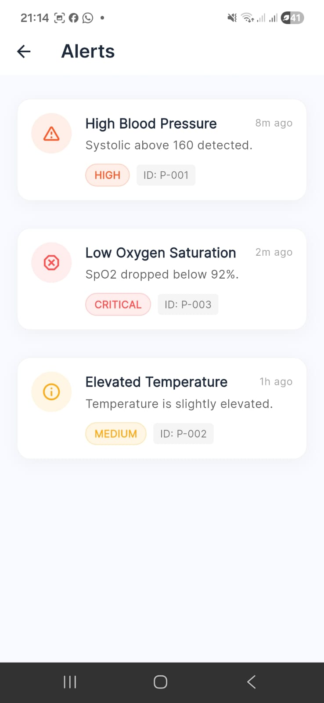
  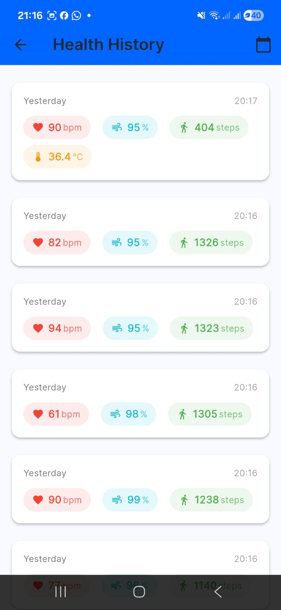
</p>

### ⚙️ Administration

<p align="center">
  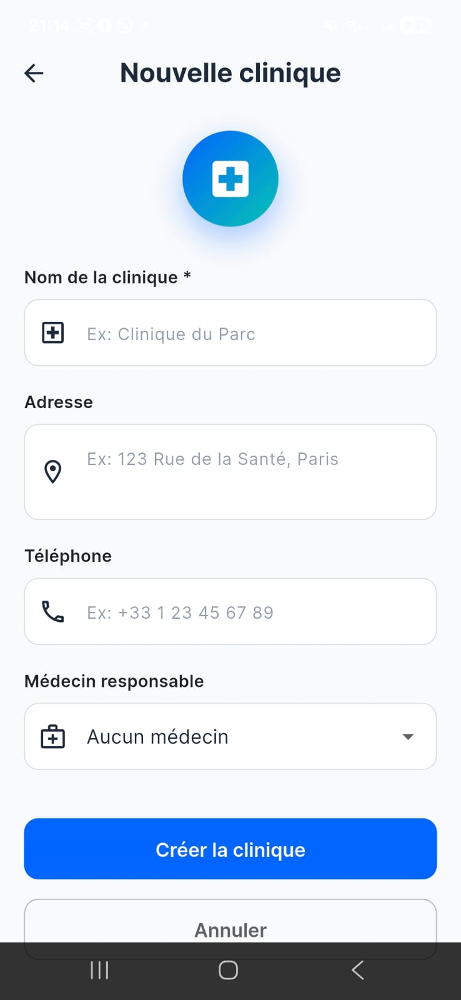
  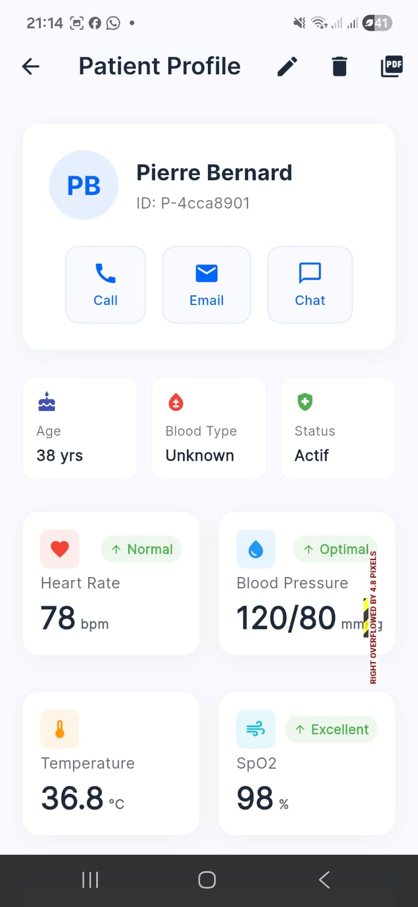
  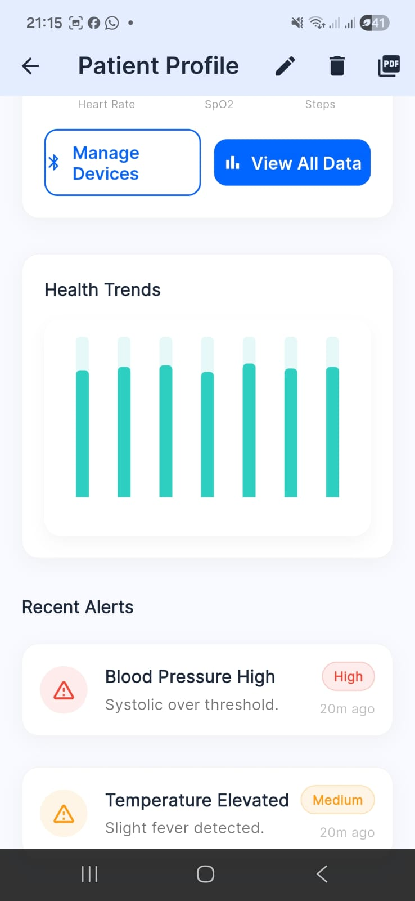
</p>

---

## 🚀 Installation

### Prérequis

- **Flutter SDK** 3.x+
- **Java JDK** 17+
- **Maven** 3.x+
- **PostgreSQL** 15+
- **Git**

### 1️⃣ Cloner le Projet

```bash
git clone https://github.com/votre-username/clinalert.git
cd clinalert
```

### 2️⃣ Backend (Spring Boot)

```bash
# Naviguer vers le backend
cd backend/doctortracker-backend

# Configurer la base de données dans application.yml
# spring.datasource.url=jdbc:postgresql://localhost:5432/clinalert

# Lancer le serveur
mvn spring-boot:run
```

Le serveur démarre sur `http://localhost:8080`

### 3️⃣ Frontend (Flutter)

```bash
# Revenir à la racine
cd ../..

# Installer les dépendances
flutter pub get

# Lancer l'application
flutter run
```

### 🐳 Docker (Optionnel)

```bash
# Backend
cd backend/doctortracker-backend
docker build -t clinalert-backend .
docker run -p 8080:8080 clinalert-backend
```

---

## ⚙️ Configuration

### Backend (`application.yml`)

```yaml
spring:
  datasource:
    url: jdbc:postgresql://localhost:5432/clinalert
    username: postgres
    password: votre_mot_de_passe

app:
  jwtSecret: votre_secret_jwt_256_bits
  jwtExpirationMs: 86400000
```

### Frontend

| Fichier | Configuration |
|---------|---------------|
| `lib/services/api_service.dart` | URL du backend |
| `lib/services/ble_service.dart` | UUIDs BLE de la SmartWatch |

**URLs Backend :**
- Émulateur Android : `http://10.0.2.2:8080/api`
- Simulateur iOS : `http://localhost:8080/api`
- Appareil physique : `http://192.168.x.x:8080/api`

---

## 🔐 Sécurité

### Authentification JWT

```
┌──────────┐     POST /api/auth/login      ┌──────────────┐
│  Client  │ ────────────────────────────► │   Backend    │
│          │ ◄──────────────────────────── │              │
└──────────┘     { token, userId, role }   └──────────────┘
      │                                            │
      │        Authorization: Bearer <token>       │
      └────────────────────────────────────────────┘
```

### Matrice des Permissions

| Endpoint | ADMIN | DOCTOR | NURSE | PATIENT |
|----------|:-----:|:------:|:-----:|:-------:|
| `/api/users/*` | ✅ | ❌ | ❌ | ❌ |
| `/api/patients/*` | ✅ | ✅ | ✅ | ❌ |
| `/api/clinics/*` | ✅ | ✅ | ❌ | ❌ |
| `/api/smartwatch/*` | ✅ | ✅ | ✅ | ✅* |
| `/api/alerts/*` | ✅ | ✅ | ✅ | ✅* |

*\* Accès limité aux données personnelles*

---

## 📚 Documentation API

### Endpoints Principaux

#### 🔑 Authentification
| Méthode | Endpoint | Description |
|---------|----------|-------------|
| `POST` | `/api/auth/login` | Connexion utilisateur |
| `POST` | `/api/auth/register` | Inscription |
| `GET` | `/api/auth/me` | Profil connecté |

#### 👥 Patients
| Méthode | Endpoint | Description |
|---------|----------|-------------|
| `GET` | `/api/patients` | Liste des patients |
| `GET` | `/api/patients/{id}` | Détails d'un patient |
| `POST` | `/api/patients` | Créer un patient |
| `PUT` | `/api/patients/{id}` | Modifier un patient |
| `DELETE` | `/api/patients/{id}` | Supprimer un patient |

#### ⌚ SmartWatch
| Méthode | Endpoint | Description |
|---------|----------|-------------|
| `POST` | `/api/smartwatch/devices` | Enregistrer un appareil |
| `POST` | `/api/smartwatch/health-data` | Soumettre des données |
| `GET` | `/api/smartwatch/health-data/{patientId}` | Historique complet |
| `GET` | `/api/smartwatch/health-data/{patientId}/stats` | Statistiques |

---

## 📁 Structure du Projet

```
clinalert/
├── 📱 lib/                          # Code Flutter
│   ├── models/                      # Modèles de données (15 classes)
│   ├── screens/                     # Écrans de l'app (27 écrans)
│   ├── services/                    # Services (API, BLE, Auth)
│   ├── providers/                   # State management (Provider)
│   ├── widgets/                     # Composants réutilisables
│   ├── themes/                      # Configuration thèmes
│   └── l10n/                        # Traductions (FR/EN/AR)
│
├── 🖥️ backend/doctortracker-backend/
│   └── src/main/java/
│       └── com/clinalert/doctortracker/
│           ├── model/               # Entités JPA (9 classes)
│           ├── repository/          # Repositories Spring Data
│           ├── service/             # Logique métier
│           ├── controller/          # Endpoints REST
│           └── security/            # Configuration JWT
│
├── 📄 docs/                         # Documentation
│   ├── images/                      # Screenshots & Diagrammes
│   ├── complete_report.tex          # Rapport technique LaTeX
│   └── frontend_documentation.tex   # Doc frontend
│
└── 📋 README.md                     # Ce fichier
```

---

## 🧪 Tests

```bash
# Tests Flutter
flutter test

# Tests Backend
cd backend/doctortracker-backend
mvn test
```

---

## 🤝 Contribution

Les contributions sont les bienvenues ! 

1. Fork le projet
2. Créer une branche (`git checkout -b feature/AmazingFeature`)
3. Commit (`git commit -m 'Add AmazingFeature'`)
4. Push (`git push origin feature/AmazingFeature`)
5. Ouvrir une Pull Request

---

## 📄 Licence

Ce projet est sous licence MIT. Voir le fichier `LICENSE` pour plus de détails.

---

## 👥 Équipe

<p align="center">
  Développé avec ❤️ pour améliorer le suivi médical
</p>

---

<p align="center">
  <strong>ClinAlert</strong> - Système de Suivi Médical Intelligent<br/>
  <em>Healthcare Monitoring System</em>
</p>
